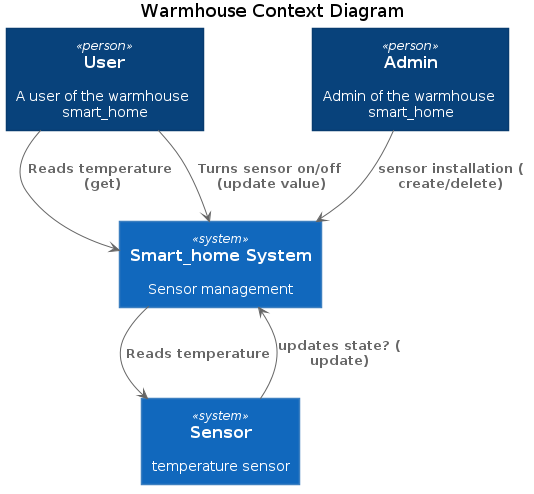
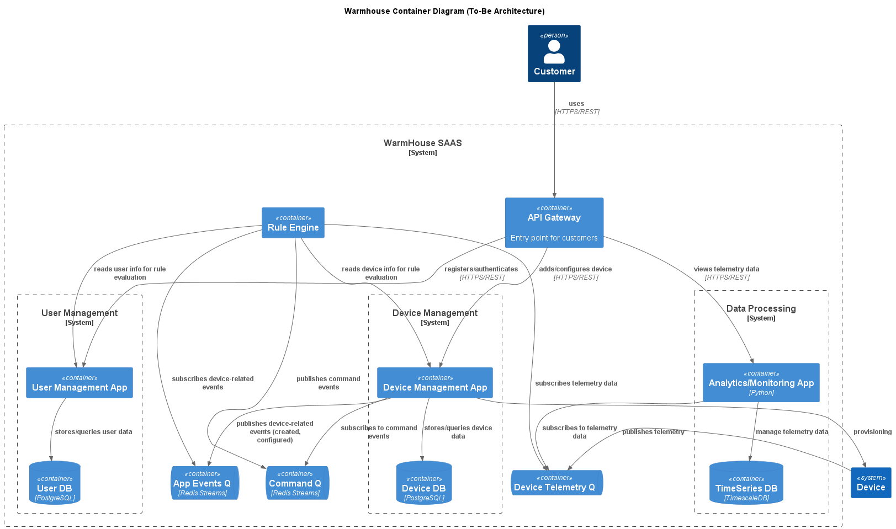
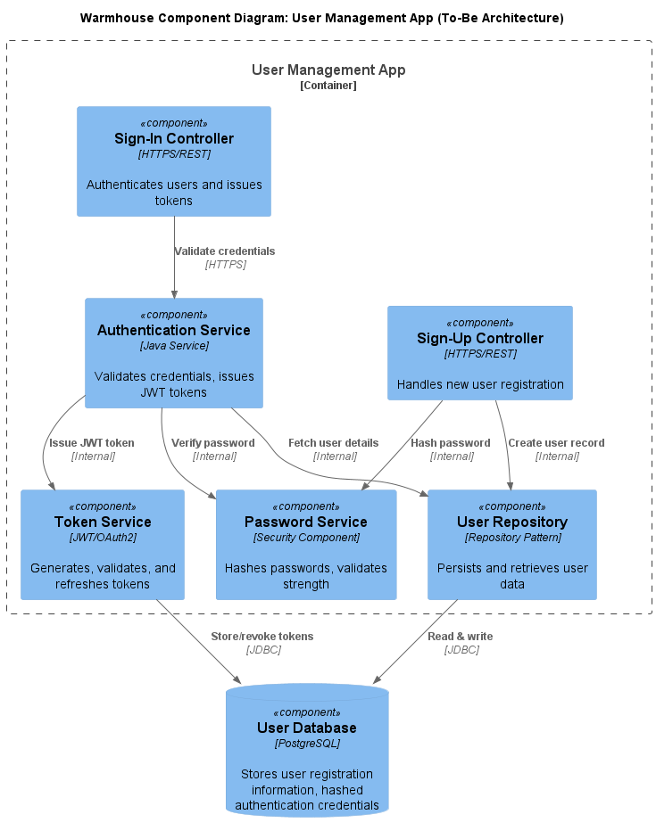
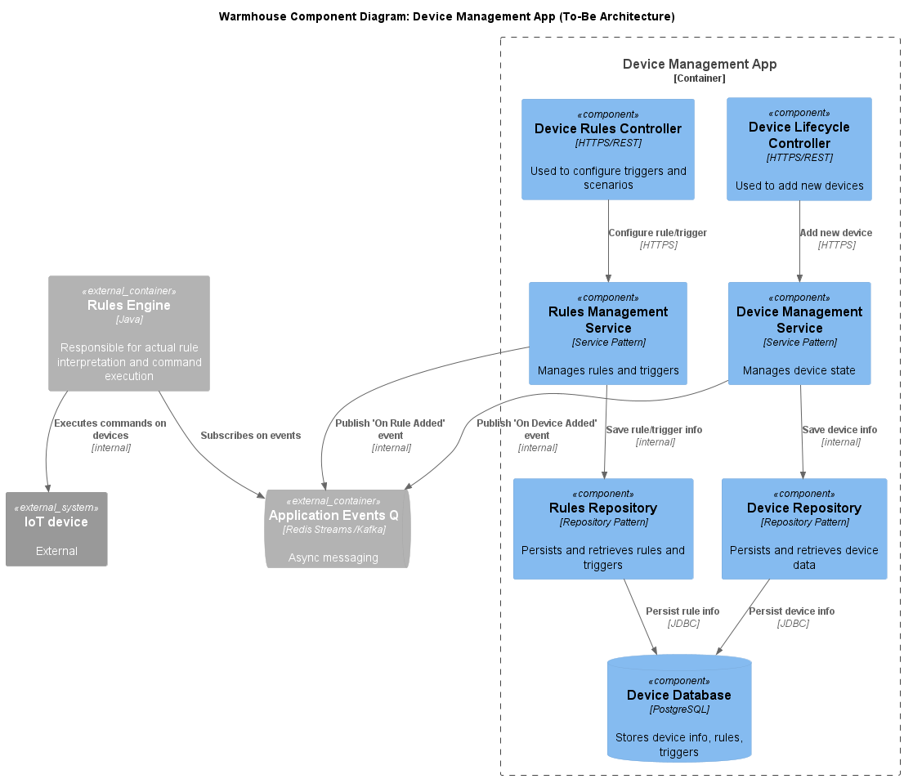
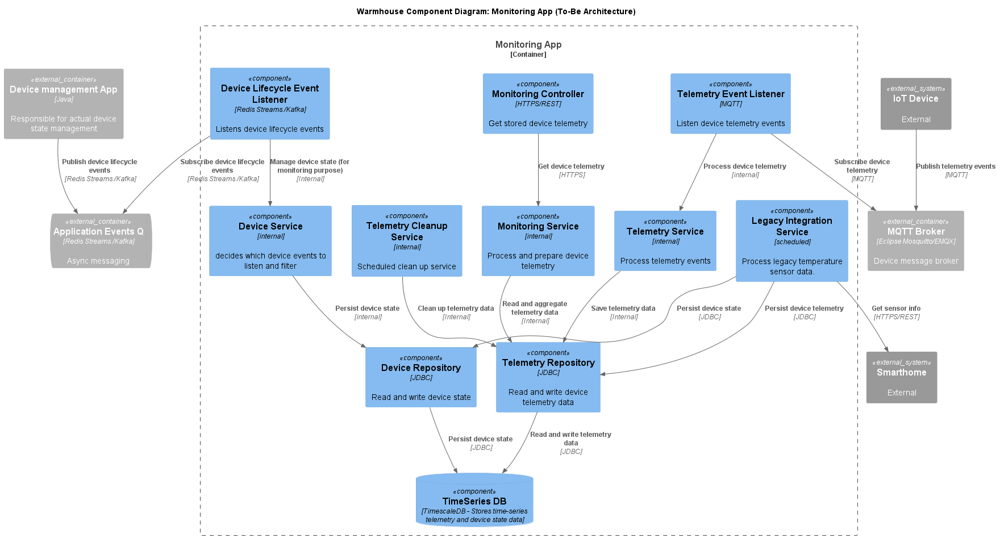
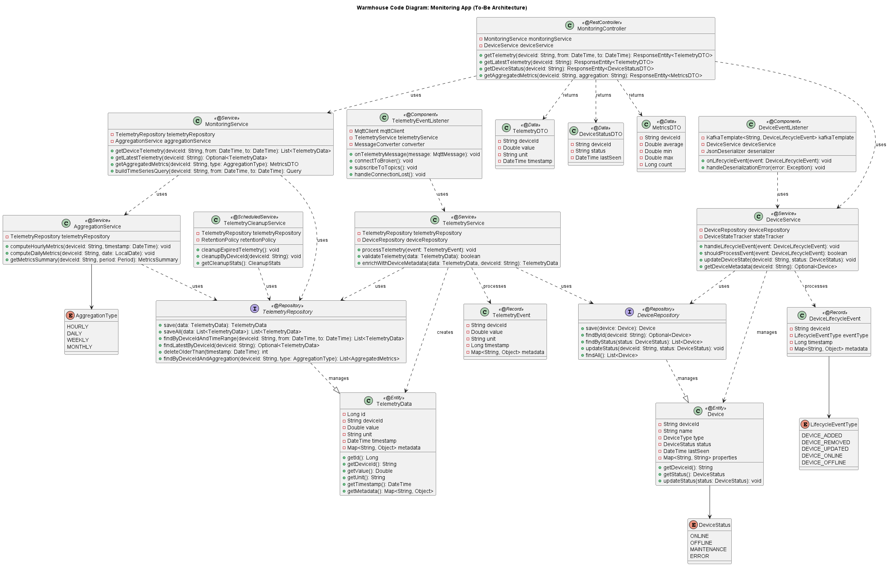
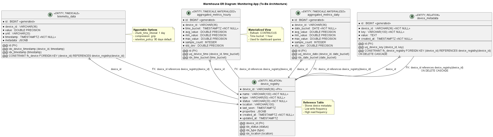

# Project_template

# Задание 1. Анализ и планирование

### 1. Описание функциональности монолитного приложения

- Нынешнее приложение компании позволяет управлять отоплением в доме и проверять температуру.
- Каждая установка сопровождается выездом специалиста по подключению системы отопления в доме к текущей версии системы.
- Архитектура приложения представляет из себя монолит на Go с СУБД Postgres. Всё синхронно. Никаких асинхронных вызовов, микросервисов и реактивного взаимодействия в системе нет. Всё управление идёт от сервера к датчику. Данные о температуре также получаются через запрос от сервера к датчику.
- Самостоятельно подключить свой датчик к системе пользователь не может.

**Управление отоплением:**

- Пользователи могут могут удалённо включать/выключать отопление в своих домах.
- Система поддерживает:
	- управление датчиками температуры: создание, удаление, изменение 

**Мониторинг температуры:**

- Пользователи могут просматривать текущую температуру в своих домах через веб-интерфейс.
- Система поддерживает:
	- чтение состояния датчиков, показаний температуры
	
### 2. Анализ архитектуры монолитного приложения

В ходе анализа архитектуры приложения были выявлены следующие особенности: 

- Язык программирования: Go
- База данных: PostgreSQL
- Архитектура: Монолитная, все компоненты системы (обработка запросов, бизнес-логика, работа с данными) находятся в рамках одного приложения.

### 3. Определение доменов и границы контекстов

### AS IS 
- Домен: Управление Устройствами
	- поддомен: Система отопления
		- контекст: Управление отоплением

- Домен: Мониторинг Устройств
	- поддомен: Система отопления
		- контекст: Мониторинг температуры

### TO BE

В рамках стратегического проектирования были определены основные домены и поддомены системы с учетом требований к целевой экосистеме:

- Экосистема доступна пользователю в режиме самообслуживания по модели SaaS.
- Позволяет управлять отоплением, включать и выключать свет, запирать и отпирать автоматические ворота, удалённо наблюдать за домом, возможно и будущее неуточнённое поведение.
- Пользователь самостоятельно выбирает необходимые ему модули умного дома (устройства), сам их подключает, настраивает сценарии работы и просматривает телеметрию.
- Компания не занимается производством устройств, но поддерживает подключение к экосистеме устройств партнеров по стандартным протоколам.

- Домен: Управление Устройствами
	- поддомен: управление пользователями
		- контекст: регистрация новых пользователей
		- контекст: аутентификация и авторизация пользователя

	- поддомен: управление жизненным циклом устройств
		- контекст: регистрация новых устройств
		- контекст: конфигурирование устройств
		- контекст: вывод устройств из эксплуатации

	- поддомен: управление действиями устройствами
		- контекст: программирование сценариев и реакций на события
		- контекст: исполнение сценариев

- Домен: управление тарификацией
	- поддомен: описание правил и условий подписки 
	- поддомен: управление подпиской пользователя
		- контекст: обработка транзакий
		- контекст: ведение журнала транзакций
		- контекст: ведение состояния подписки

- Домен: Мониторинг Устройств
	- поддомен: сбор данных
		- контекст: мониторинг состояния устройств: метрики, здоровье, статус
		- контекст: сбор телеметрии устройтв 
		- контекст: хранение телеметрии 

### **4. Проблемы монолитного решения**	

- Взаимодействие: Синхронное, запросы обрабатываются последовательно.
- Масштабируемость: Ограничена, так как монолит сложно масштабировать по частям.
- Развертывание: Требует остановки всего приложения.
- Отсутствует разделение ответственности, один сервис отвечает за взаимодействие с пользователями и администрироование устройств

### 5. Визуализация контекста системы — диаграмма С4

Диаграмма контекста в модели C4.

# Задание 2. Проектирование микросервисной архитектуры

В этом задании вам нужно предоставить только диаграммы в модели C4. Мы не просим вас отдельно описывать получившиеся микросервисы и то, как вы определили взаимодействия между компонентами To-Be системы. Если вы правильно подготовите диаграммы C4, они и так это покажут.

**Диаграмма контейнеров (Containers)**

**Диаграмма компонентов (Components)**

Добавьте диаграмму для каждого из выделенных микросервисов.

[warmhouse_component_user_management_to_be](schemas/to_be/warmhouse_component_user_management_to_be.puml)

[warmhouse_component_device_management_to_be](schemas/to_be/warmhouse_component_device_management_to_be.puml)

[warmhouse_component_monitoring_to_be](schemas/to_be/warmhouse_component_monitoring_to_be.puml)

**Диаграмма кода (Code)**

# Задание 3. Разработка ER-диаграммы

Добавьте сюда ER-диаграмму. Она должна отражать ключевые сущности системы, их атрибуты и тип связей между ними.

[twarmhouse_er_monitoring_to_bet](schemas/to_be/warmhouse_er_monitoring_to_be.puml)

# Задание 4. Создание и документирование API

### 1. Тип API

Укажите, какой тип API вы будете использовать для взаимодействия микросервисов. Объясните своё решение.

- Для взаимодействия клиента с системой: HTTPS/REST
- Взаимодействия устрйств с микросервисами: Publish/Subscribe, например MQTT 
- Взаимодействие между микросервисами может быть REST или Publish/Subscribe (Redis Streams/Kafka)

### 2. Документация API

Здесь приложите ссылки на документацию API для микросервисов, которые вы спроектировали в первой части проектной работы. Для документирования используйте Swagger/OpenAPI или AsyncAPI.

[Monitoring app api](./schemas/to_be/monitoring-api-openapi.yaml)

# Задание 5. Работа с docker и docker-compose

Done

# **Задание 6. Разработка MVP**

Done.
